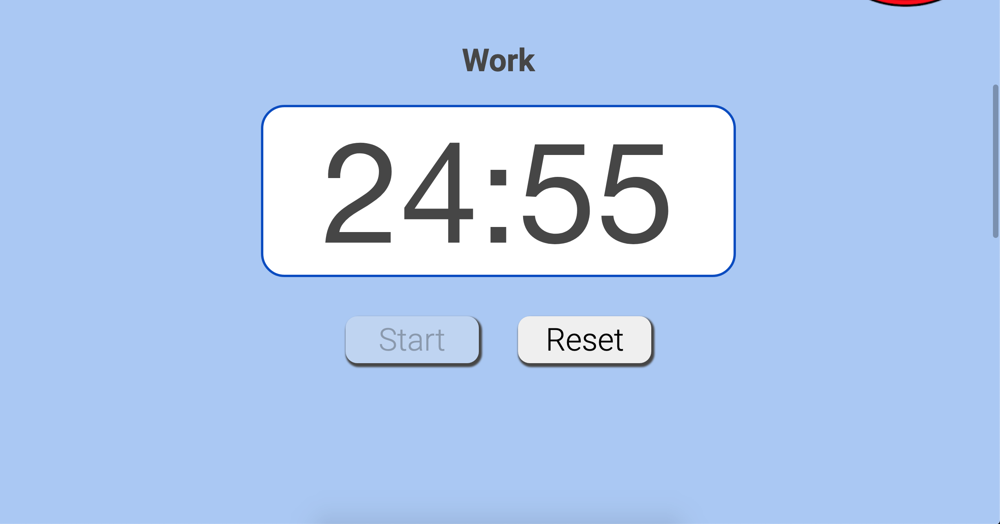

# CSE 110 W20 Team 35 Meeting Minutes

## Meeting Objective: Sprint 2 Review

**Date: Thursday 2/23/2021**  
**Start Time: Zoom 12:30 pm PT**  
**End Time: 1 pm PT**  
**Attendees (Name, Role):**  
1. Sydney Wong
2. Nidhi Giridhar
3. Alejandro Marquez
4. Jasmine Chen
5. Alejandro Malanche
6. Zachary Chan
7. Samuel Burkholder
8. Ian Rebmann

**Absent (Name, Role)**:  
   
## Agenda: 
   1. Recap what is completed so far
   2. Recap what is being moved to sprint 3 and backlog
   3. Everyone reviews their accomplishments and feelings regarding sprint 2
   4. Plan for Sprint 3

## Completed Tasks (from previous meeting):

## Pending Business (from previous meeting):

## Notes, Decisions, Issues: 
  * completed so far
    * implement timer
    * implement buttons
    * instructions at the button of the screen
    * styling/css
    * streak counters
    * tomato icon
  * backlog or next sprint
    * more testing
    * automation of timer
    * integrating notifications with the timer and buttons
  * individual reviews
    * Ian
      * faced some problems with css -> researched online
      * learned a lot through standups and seeing what other people completed
      * proud of what the team accomplishments
      * Researched, Experimental programing and Implemented css styling
      * Above done for the following features 
      * [Counters](https://github.com/nidhigiridhar/cse110-w21-group35/blob/master/admin/meetings/sprint-2-images/t1.PNG)
      * Streak counter 
      * Total counter
      * [Buttons and Instructions](https://github.com/nidhigiridhar/cse110-w21-group35/blob/master/admin/meetings/sprint-2-images/t2.PNG)  
      * Start button 
      * Reset button 
      * Instructions 

    * Alejandro Marquez
      * worked on notifications part of timer
      * though the implementation was straightforward
      * faced difficulties with testing the notifications -> had to do intensive research
      * was able to complete the notification testing
      * had to refactor notification javascript code multiple timers
      * proud of everyone for coming together in the final hour
      * Notitifcation Screenshots:
        * [Mini Banner](sprint-2-images/Mini-Banner.png)
        * [Full Banner](sprint-2-images/Full-Banner.png)
      * Sound demonstration will be included in the demo video posted in our repo at /admin/videos/statusvideo1.mp4
      * [Notifications Code Part-1](sprint-2-images/notifications-code-part1.png)
      * [Notifications Code Part-2](sprint-2-images/notifications-code-part2.png)
    * Jasmine
      * worked on css and final integration
      * css was straightforward
      * faced initial problems with vsCode Live Share
      * is currently researching how we can improve our workflow to avoid sprint 2's integration problems
      * [CSS for timer and buttons](sprint-2-images/timer-css.png)
      * [Footer](sprint-2-images/footer.png)
      * [Variables](sprint-2-images/variables.png)
      * [Timer CSS code](sprint-2-images/timer-css-code.png)
      * [Button CSS code](sprint-2-images/button-css-code.png)
    * Alejandro Malanche
      * intially thought timer implementation was straightforward
      * Alejandro Marquez revealed some problems with the timer
      * however, it was helpful to see how javascript interacts with different types of browser
      * [Timer Code](sprint-2-images/timer_code_1.png)
    * Sam
      * worked on implementing the start and reset buttons
      * Helped get Jest set up and unit testing figured out
      * faced some initial difficulties with vsCode Live Share
      * it was difficult to coordinate with other people who were working on other parts of the project (timer people coordinating with button people)
    * Zachary
      * worked on notifications
      * main obstacle was testing the notifications
      * [Notifications Code Part-1](sprint-2-images/notifications-code-part1.png)
      * [Notifications Code Part-2](sprint-2-images/notifications-code-part2.png)
    * Sydney
      * worked on the start and reset buttons (HTML and Javascript)
      * added [event listeners](sprint-2-images/button-event-listeners.png) to the buttons
      * added [methods](sprint-2-images/onStart-onReset-functions.png) that were called once the buttons are clicked (internal logic of disabling buttons and reseting the state of the timer on the app)
      * faced problems with JUnit testing and figureing out the DOM manipulation
      * got the [Jest tests](sprint-2-images/some-timer-tests.png) working on the pipeline using the [GitHub actions](sprint-2-images/jest-github-action.png)
      * is still facing problems with the GitHub action for documentation (although she  created [documentation](sprint-2-images/html-documentation.png) locally and pushed for now)
    * Nidhi
      * worked on timer
      * Realized that the timer does not count down the seconds correctly after Alejandro Marquez pointed it out, so Alejandro and I had to re-write the timer using a different implementation. 
      * faced problems with testing timer and exporting timer.js to timer.test.js
      * also worked on documentation part of pipeline which had a lot of problems
      * Screenshots of the timer running in different states:  
  * Planning Sprint 3 [(board found here)](https://github.com/nidhigiridhar/cse110-w21-group35/projects/3)
    * fixing the inaccurate timer - Nidhi, Alejandro Malanche
    * figure out the automation of the timer - Nidhi, Alejandro Malanche
    * remove delay after pressing start - Nidhi, Alejandro Malanche
    * CSS background changes - Jasmine
    * break reminders (step away from screen during breaks) - Jasmine
    * integrate notifications with timer - Zachary, Nidhi, Alejandro Malanche
    * keyboard shortcuts - Sam
    * non-static instructions - Syd, Alejandro Malanche, Alejandro Marquez, Nidhi
    * testing throughout the sprint (more so than at the end like sprint 2) - Syd, 

## TODOs: 

## To discuss at next meeting:

  
