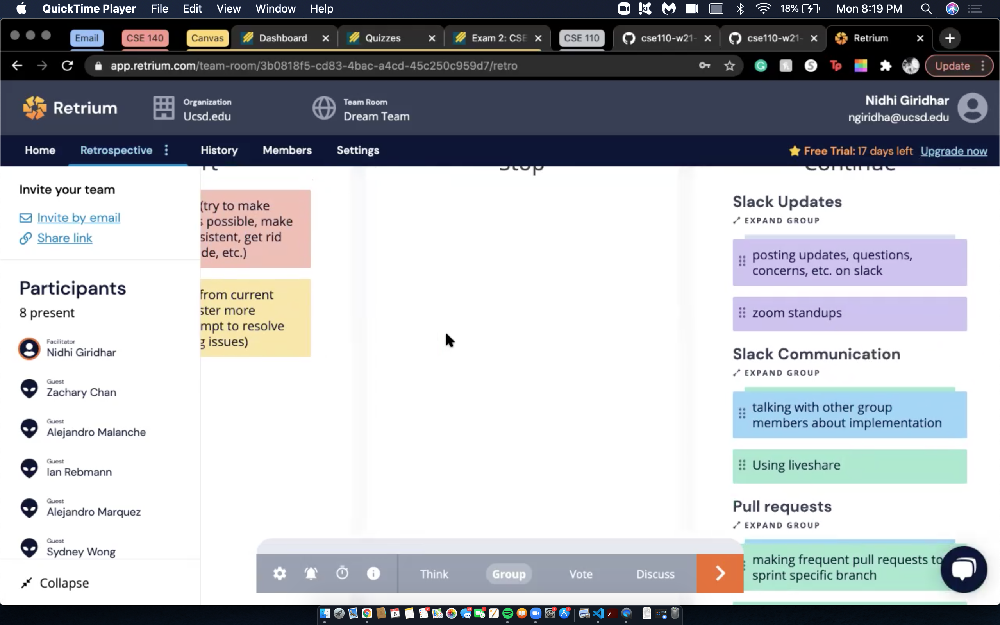

# CSE 110 W20 Team 35 Meeting Minutes

## Meeting Objective: Sprint 3 Retrospective

**Date: Tuesday 3/8/2021**  
**Start Time: Zoom 4 pm PT**  
**End Time: 4:30 pm PT**  
**Attendees (Name, Role):**  
1. Sydney Wong
2. Nidhi Giridhar
3. Alejandro Marquez
4. Jasmine Chen
5. Alejandro Malanche
6. Zachary Chan
7. Samuel Burkholder
8. Ian Rebmann

**Absent (Name, Role)**:  
   
## Agenda: 
   1. Complete Sprint 3 retrospective using Retrium

## Completed Tasks (from previous meeting):

## Pending Business (from previous meeting):

## Notes, Decisions, Issues: 
  * we discussed action items for some of our concerns
  * clean up code
    * clean up css (make it more concise)
    * finish up documentation
    * make a read me
  * merge sprint 3 to master branch
    * we will create a pull request to sprint 3 once we have added the progress bar and added customtimelimits test
  * delete branches
    * all branches should be deleted except for the master branch
  * slack communication
    * communication was better this sprint
    * continue communicating more on Slack
    * continue to talk to other team members about coordinate
  * more frequent pull requests
    * this method of pull requests worked better this quarter
  * continue using live share, doing zoom standups
  * break reminders
    * they should appear as the background color is changed (before the start button is clicked)
  * Here are some screenshots of Retrospective created on Retrium
    * We used the Start,Stop,Continue method where we listed down things we want to start doing, things we should stop doing and things we should continue doing.
    * We then grouped similar ideas together and then proceeded to vote on the ones that we wanted to discuss. 
    * Then, we discussed each group (starting with the one with the highest votes) and came up with an action plan to address each issue.   

## TODOs: 

## To discuss at next meeting:

  