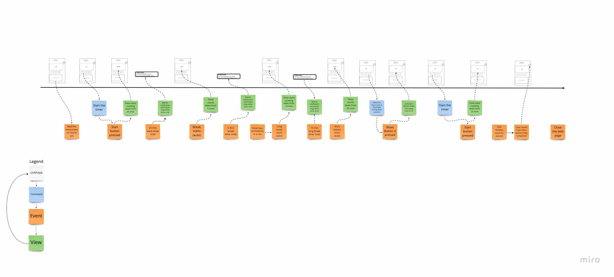

# **Productoro: A Pomodoro Timer**
## *Project Pitch created by: Dream Team (Team 35)*
1. Samuel Burkholder
2. Zachary Chan
3. Jasmine Chen
4. Nidhi Giridhar
5. Alejandro Malanche
6. Alejandro Marquez
7. Ian Rebmann
8. Sydney Wong

## The Problem
People are always striving to increase their productivity levels. Therefore, maximizing the amount of work completed within a time frame is the major problem. However, another part of the problem is that a lack of focus leads to lack of productivity. People are distracted while working and get tired when working for too long without breaks. Thus, productivity and focus must be addressed together.

As such, any solution must be simple, accessible, and user-friendly. Users, in a journey to increase focus and simplicity in their lives, do not want to be bogged down by unnecessary features in an application.

To discover this problem, we created multiple user personas and stories defining the common issues people face regarding productivity, focus, and more.

User personas and stories:  
[Office Worker](../users/office-worker.md)  
[Professor](../users/professor.md)  
[Programmer](/specs/users/programmer.md)  
[Undergraduate Student](../users/student.md)

## The Appetite
The reality of our team's situation is that we have a limited 10 weeks to create a Pomodoro application, and about five of those weeks must be spent on technical development. Therefore, we must narrow our application's focus to, foremost, developing a functional Pomodoro timer that can be intuitively understood by a user.

While our user stories show a desire for a product that can increase productivity and focus, we must not stray away from the main purpose of our application: a Pomodoro timer. We do not want to distract users from the timer element of our application with unnecessary features such as elaborate task lists. Due to the time constraint and our desire to avoid feature fatigue, we have narrowed Productoro to primarily function as a Pomodoro timer.

## Our Solution: Productoro
To address our problem, user personas, and appetite, we planned our [minimum viable product](../adr/0001-mvp.md) (MVP). Our MVP features will include:
   * Timer (25 minutes for each pomo, 5 minutes for short break, 25 minutes for long break)
   * Start button (starts the timer at beginning or when a pomo/break has been restarted)
   * Reset button (restarts current pomo)
   * Notifications notifying user when the pomo and break are done
     * Banner notifications
     * Audio notifications
  * Static instructions explaining how to use the timer
  * Static tomato icon displaying the pomo streak and pomos comletely in one day

We began designing our **interface** by considering the user stories and the features we wanted for our MVP. 

We drew fat marker sketches to brainstorm a interface that is functional, user friendly, and aesthetic.

MVP sketch:

Beyond MVP sketches:

Next, we narrowed down our designs by developing wireframes:

MVP wireframes:  

Beyond MVP wireframes:

Finally, we developed a high fidelity prototype to visualize our timer's intended functionality: [view here](https://www.figma.com/proto/t4hjtf1Mjf2cT3ixRSMBpV/Pomodoro-Timer?node-id=16%3A14&scaling=min-zoom)

Additionally, we developed **system diagrams** to accompany the interface designs. The system diagrams detail how different parts of our web app will interact with each other at three different levels.

C4 Component Diagram:

C4 Container Diagram:

C4 Context Diagram:

C4 Component Diagram for Beyond the MVP:

Event Modeling Diagram:

## Rabbit Holes
A major rabbit hole is our tasks list feature. The tasks feature is not central to our application nor the Pomodoro technique. As such, we must make sure Productoro does not transform into a planner application mid-development.

We have explain more reasoning regarding the addition of the tasks feature at [task.md](../adr/0003-tasks.md)

## No-gos
We will not be implementing a pause function since a pause feature directly contradicts the Pomodoro technique. The Pomodoro technique is a time management technique that breaks work down into intervals that should be completed without interruptions. The ability to pause in the middle of an interval and continue the interval when the user pleases does not align with the Pomodoro technique.

Realistically, we understand a user might need to *restart* a pomo or break, so created a reset button that restarts a pomo to the 25 minute mark. We provided more explanation in our [start_stop_reset.md](./../adr/0004-start_stop_reset.md).

## Our Implementation Plan
We have broken down Productoro's features into  different sprints. Our main goal is to implement the MVP features during sprint 2, and a detailed outline of our implementation plan can be seen on our [project roadmap](../roadmap.md).

Furthermore, we will be using a Github repository and its features to develop Productoro.

The issues for the sprint 2 features can be viewed on our repository and [project board](https://github.com/nidhigiridhar/cse110-w21-group35/projects/2).

Within our repository, we will use multiple development branches beginning at the start of sprint 2. For our branching structure, our team will develop features on feature-specific branches and then push the branch to master. We will create the following branches:
   * timer
   * buttons
   * notifications
   * instructions
   * counter
   * keyboard shortcuts
   * background color changes
   * settings
   * tasks
   * ui

Beginning with sprint 2, everyone will use pull requests to push their development branch to master. Everyone must also link their pull requests to the corresponding issue from the project board. During a pull request, if a conflict is found while merging, the person(s) assigned to the development issue must work and coordinate with the team to resolve the conflicts.

Roles of team members:
   * Nidhi Giridhar: primary coordinator, UI/UX
   * Sydney Wong: secondary coordinator, pipeline, UI/UX
   * Alejandro Malanche: testing, database
   * Samuel Burkholder: testing
   * Alejandro Marquez: testings, database
   * Jasmine Chen: datebase, UI/UX, pipeline
   * Zachary Chan: database
   * Ian Rebmann: UI/UX, pipeline
